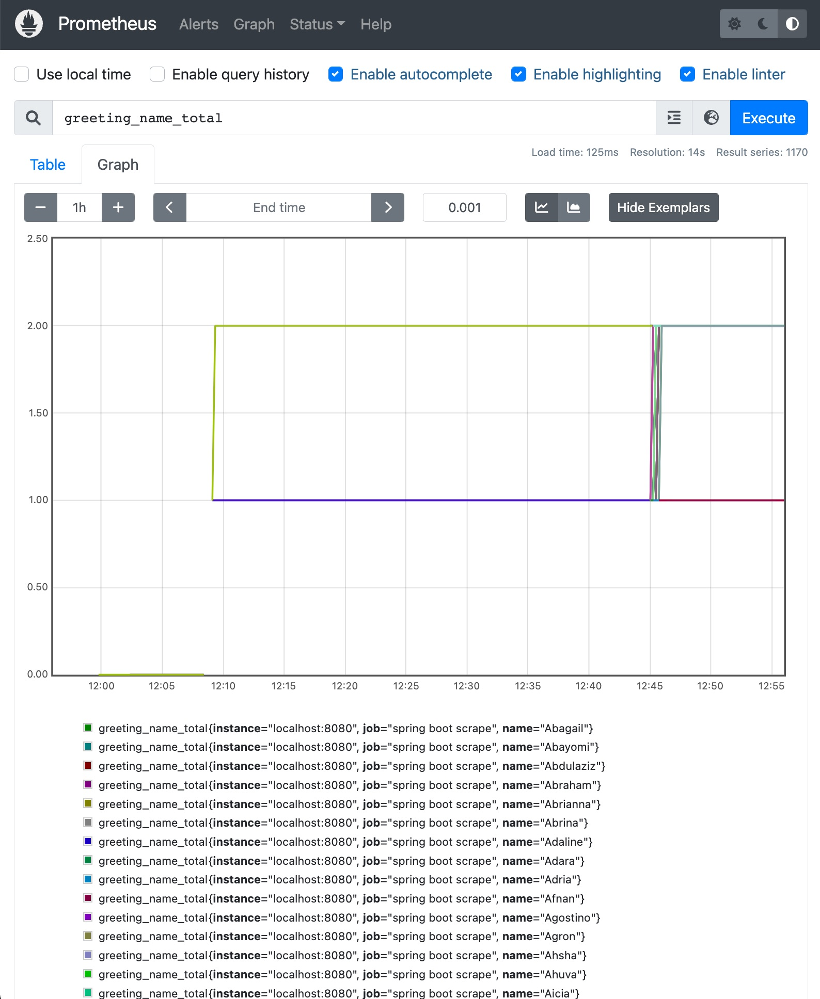

# Spring Prometheus

http://localhost:8080/actuator/prometheus

After a hundred executions of `greethig.sh`, you'll see something like:

```
$ http --body "localhost:8080/actuator/prometheus" | egrep '^greet'
greeting_time_seconds{class="name.seguri.java.tutorials.Controller",exception="none",method="greeting",quantile="0.5",} 3.26656E-4
greeting_time_seconds{class="name.seguri.java.tutorials.Controller",exception="none",method="greeting",quantile="0.9",} 5.0688E-4
greeting_time_seconds_count{class="name.seguri.java.tutorials.Controller",exception="none",method="greeting",} 1214.0
greeting_time_seconds_sum{class="name.seguri.java.tutorials.Controller",exception="none",method="greeting",} 0.45923624
greeting_time_seconds_max{class="name.seguri.java.tutorials.Controller",exception="none",method="greeting",} 0.004176868
greeting_name_total{name="Chassidy",} 1.0
greeting_name_total{name="Emileigh",} 1.0
greeting_name_total{name="Humza",} 1.0
greeting_name_total{name="Arlan",} 1.0
greeting_name_total{name="Julius",} 2.0
greeting_name_total{name="Tanekia",} 1.0
greeting_name_total{name="Carlus",} 1.0
...
```

And in the Prometheus dashboard:



## See also

- [Spring Boot app metrics - with Prometheus and Micrometer](https://www.tutorialworks.com/spring-boot-prometheus-micrometer/)
